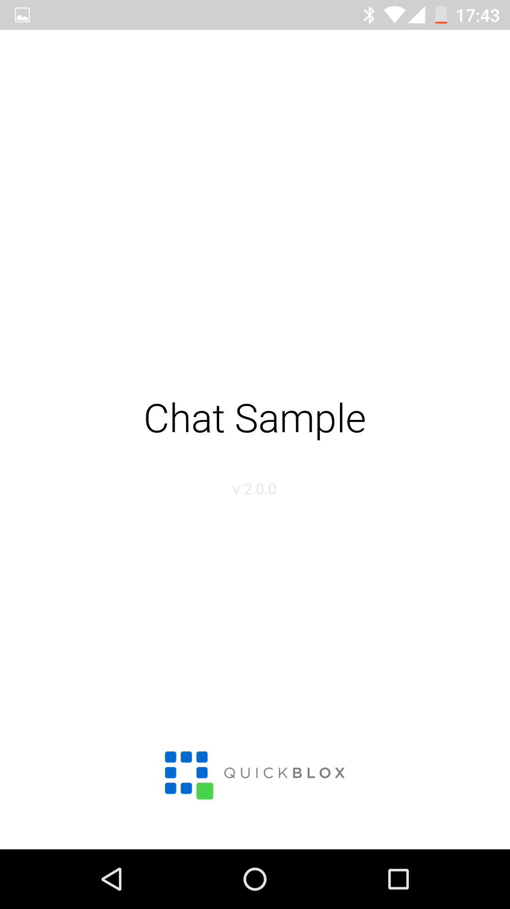
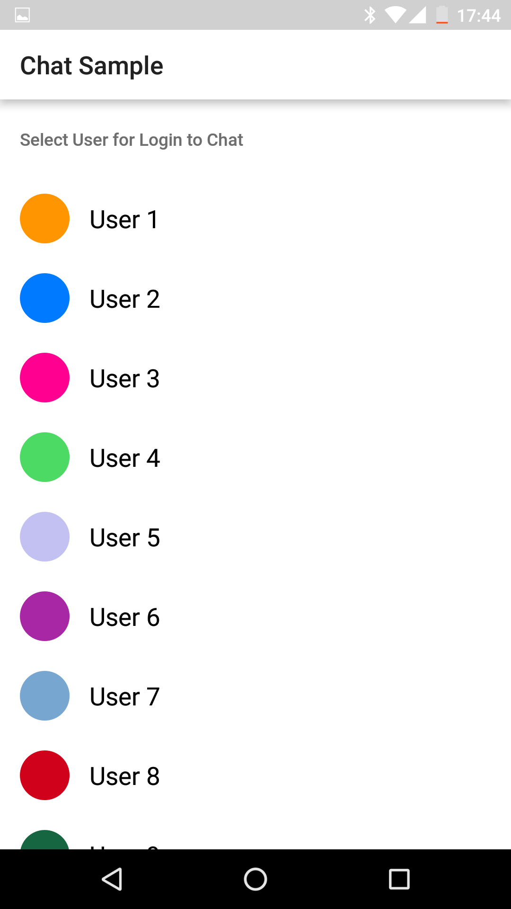
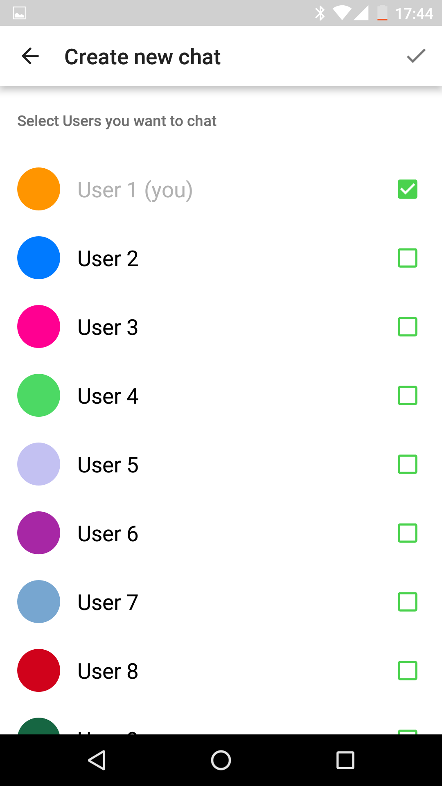
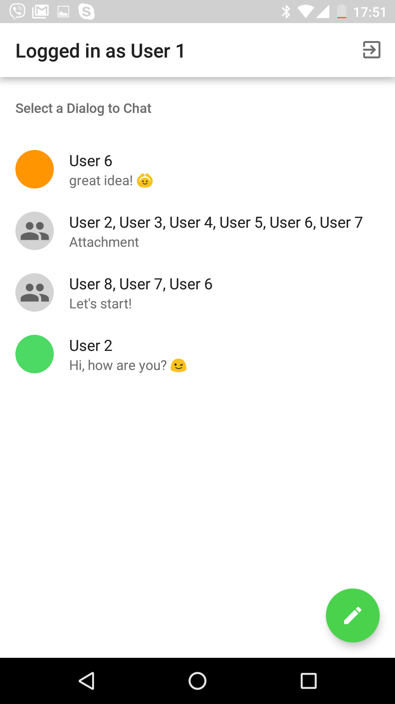
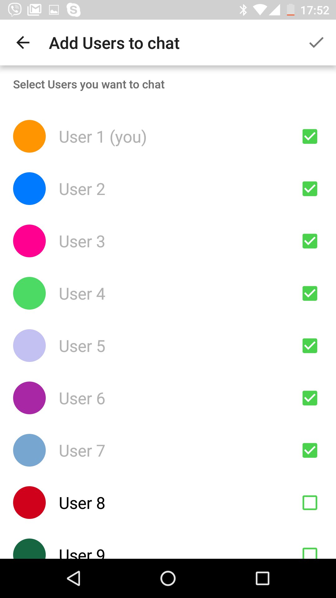

## QuickBlox Android XMPP Chat Sample

Go to project page on QuickBlox Developers Section -- <http://quickblox.com/developers/Android_XMPP_Chat_Sample>

Or clone project here and start to work with the code.

&nbsp;&nbsp;&nbsp;&nbsp;&nbsp;&nbsp;
