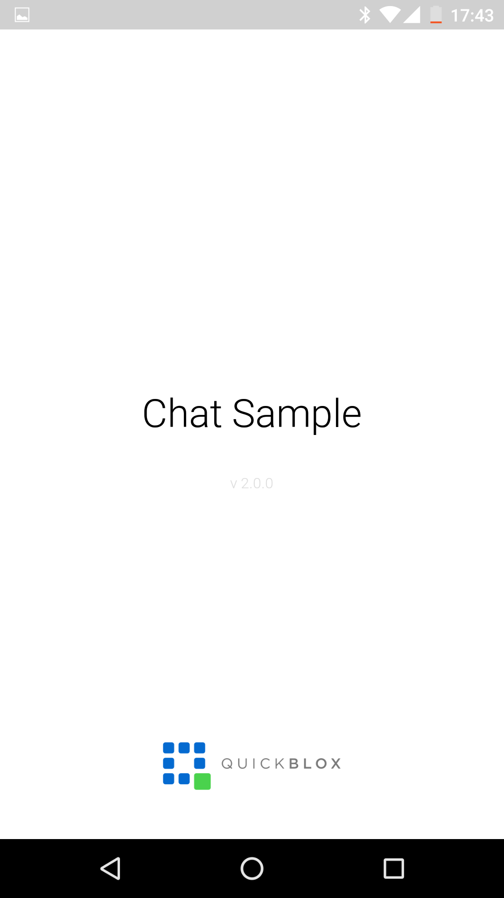
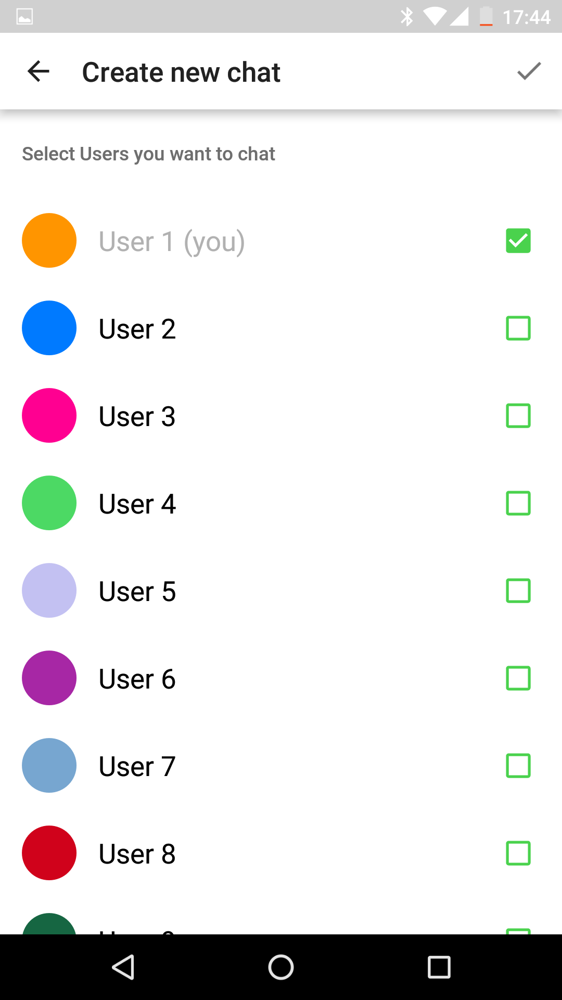
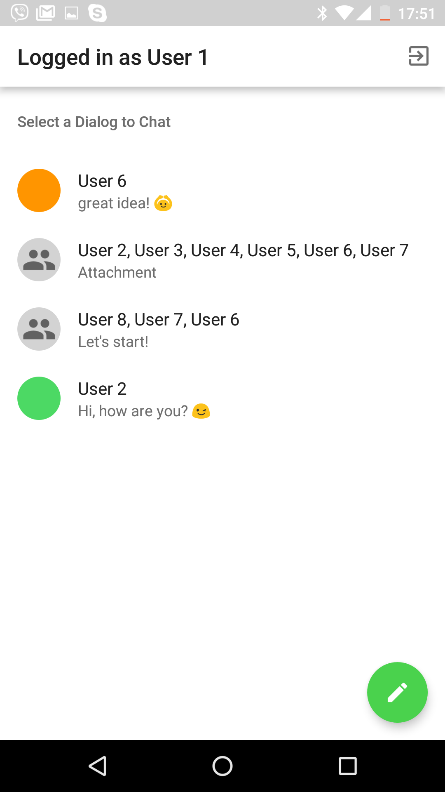
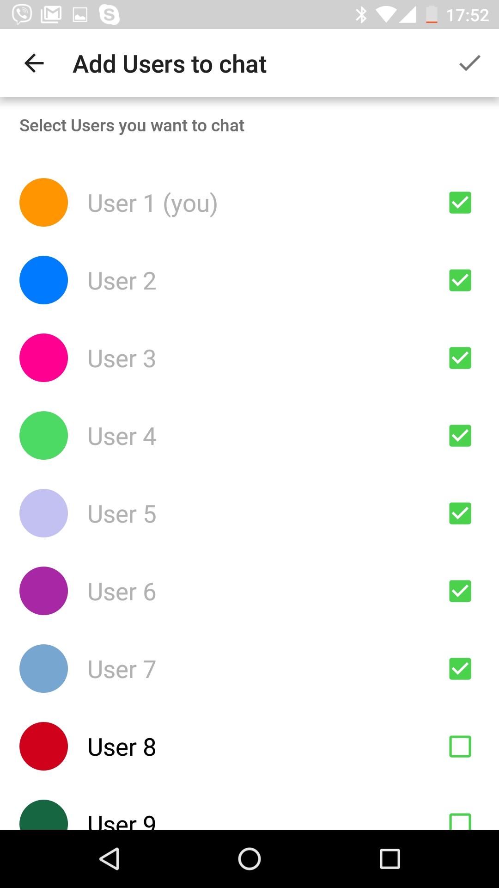

# Overview
QuickBlox Android Chat Java Sample

This is a code sample for [QuickBlox](http://quickblox.com/) platform.
It is a great way for developers using QuickBlox platform to learn how to integrate private and group chat, add text and image attachments sending into your application.

# Credentials

Welcome to QuickBlox [5 Minute Guide](https://quickblox.com/developers/5_Minute_Guide), where you can get your credentials in just 5 minutes!

# Push Notifications in Chat Sample

To receive push notifications you should have a Firebase account and Firebase Cloud Messaging project
How QuickBlox Push Notifications work:
(https://quickblox.com/developers/SimpleSample-messages_users-android#How_QuickBlox_Push_Notifications_work)

If you already have GCM (Google Cloud Messaging) account you need to migrate from GCM to FCM:
(https://quickblox.com/developers/How_to_migrate_from_GCM_to_FCM)

If you have no FCM (Firebase Cloud Messaging) account please make the first part (from 1 to 14 points) of this manual:
(https://quickblox.com/developers/How_to_migrate_from_GCM_to_FCM#Creation_of_a_new_project_in_the_FCM_admin_console_and_its_synchronization_with_your_app)

To setup automatic push notifications for the offline users:
(https://quickblox.com/developers/Android_XMPP_Chat_Sample#Push_notifications_to_the_offline_users)

How Push-Notifications API works:
(https://quickblox.com/developers/Messages#Push_Notifications_API)

# Chat Sample

1. Register a free QuickBlox account and add your App there.
2. Update credentials in your application code.[Chat](https://quickblox.com/developers/5_Minute_Guide#Update_authentication_credentials_2)

This Sample demonstrates how to work with [Android Chat](https://quickblox.com/developers/Android_XMPP_Chat_Sample) QuickBlox module.

It allows to:

1. Authenticate with Quickblox Chat and REST.
2. Receive and display list of dialogs.
3. Modify dialog by adding occupants.
4. Real-time chat messaging and attachment's handling.
5. Receiving Push-notifications from server in background

# Screenshots

