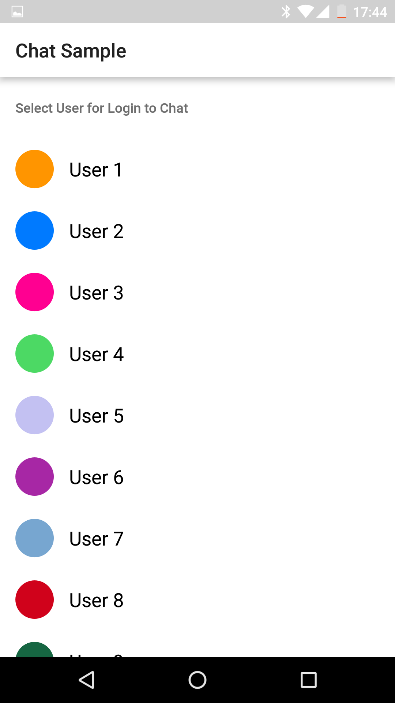
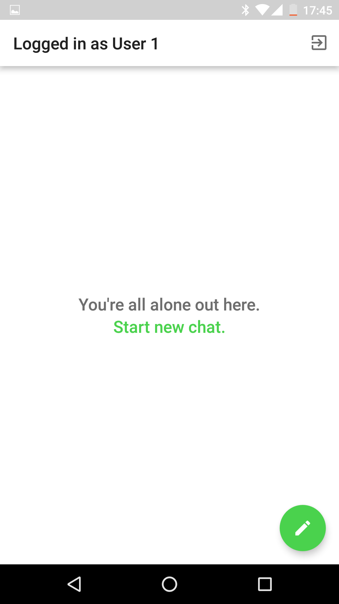

# Overview
QuickBlox Android Chat Java Sample

This is a code sample for [QuickBlox](http://quickblox.com/) platform.
It is a great way for developers using QuickBlox platform to learn how to integrate private and group chat, add text and image attachments sending into your application.

# Features 
* Login/logout
* Send and receive message/attachment
* Create and leave a 1-to-1 and group chat
* Create a public chat
* Display users who have received/read the message
* Mark messages as read/delivered
* Send typing indicators
* List and delete chats
* Display chat history
* Display a list with chat participants
* Receive push notifications
* Subscribe/unsubscribe device to push notifications
# Get application credentials

QuickBlox application includes everything that brings messaging right into your application - chat, video calling, users, push notifications, etc. To create a     QuickBlox application, follow the steps below:

  1. Register a new account following [this link](https://admin.quickblox.com/signup). Type in your email and password to sign in. You can also sign in with your Google or Github accounts.  
  2. Create the app clicking **New app** button.  
  3. Configure the app. Type in the information about your organization into corresponding fields and click **Add** button.  
  4. Go to **Dashboard => _YOUR_APP_ => Overview** section and copy your **Application ID**, **Authorization Key**, **Authorization Secret**, and **Account Key**.

# Push Notifications in Chat Sample

To receive push notifications you should have a Firebase account and Firebase Cloud Messaging project
How QuickBlox Push Notifications work:
(https://quickblox.com/developers/SimpleSample-messages_users-android#How_QuickBlox_Push_Notifications_work)

If you already have GCM (Google Cloud Messaging) account you need to migrate from GCM to FCM:
(https://quickblox.com/developers/How_to_migrate_from_GCM_to_FCM)

If you have no FCM (Firebase Cloud Messaging) account please make the first part (from 1 to 14 points) of this manual:
(https://quickblox.com/developers/How_to_migrate_from_GCM_to_FCM#Creation_of_a_new_project_in_the_FCM_admin_console_and_its_synchronization_with_your_app)

To setup automatic push notifications for the offline users:
(https://quickblox.com/developers/Android_XMPP_Chat_Sample#Push_notifications_to_the_offline_users)

How Push-Notifications API works:
(https://quickblox.com/developers/Messages#Push_Notifications_API)

# To run the Chat Sample

  1. Clone the repository using the link below:

    git clone https://github.com/QuickBlox/quickblox-android-sdk.git

  2. Go to menu **File => Open Project**. (Or "Open an existing Project" if Android Studio is just opened)  
  3. Select a path to the sample.  
  4. Select **Use default gradle wrapper** (recommended) and click **OK**.  
  5. [Get application credentials](#get-application-credentials) and get **Application ID**, **Authorization Key**, **Authorization Secret**, and **Account Key**.  
  6. Open **App.kt** (Kotlin sample) / **App.java** (Java sample)
      *//src/main/java/com/quickblox/sample/chat/java/App.java*
      and paste the credentials into the values of constants.  

    private static final String APPLICATION_ID = "";
    private static final String AUTH_KEY = "";
    private static final String AUTH_SECRET = "";
    private static final String ACCOUNT_KEY = "";

  7. Run the code sample.  

This Sample demonstrates how to work with [Android Chat](https://quickblox.com/developers/Android_XMPP_Chat_Sample) QuickBlox module.

It allows to:

1. Authenticate with Quickblox Chat and REST.  
2. Receive and display list of dialogs.  
3. Modify dialog by adding occupants.  
4. Real-time chat messaging and attachment's handling.  
5. Receiving Push-notifications from server in background  

# Screenshots

