# Overview
QuickBlox provides a Multiparty Video Conferencing solution which allows to set up video-conference between 10-12 people. It's built on top of WebRTC SFU technologies.

Video conferencing is available for customers on our paid plans. Full functionality including conference video recording is available on the Enterprise Plan only. Take advantage of Enterprise features to unlock new value and opportunities for users. For more information and to request a Demo, please contact us, [enterprise@quickblox.com](mailto:enterprise@quickblox.com).
 
# Features 
* Login/logout
* Create a conference room
* Leave a conference room
* Add a new member to a conference room
* Participate in a conference call as a streamer/watcher
* Send and receive text messages and attachments
* Enable/disable audio stream from an opponent
* Switch camera
* Enable/disable camera
* Mute/unmute the microphone
* Display the number of chat members
* Share a screen
* Change media settings
* Working in the background
* Reconnect to a conference call
# Conference flow GIF
   
   

   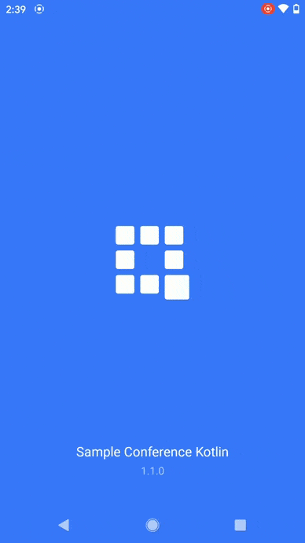
   

   
# Screenshots

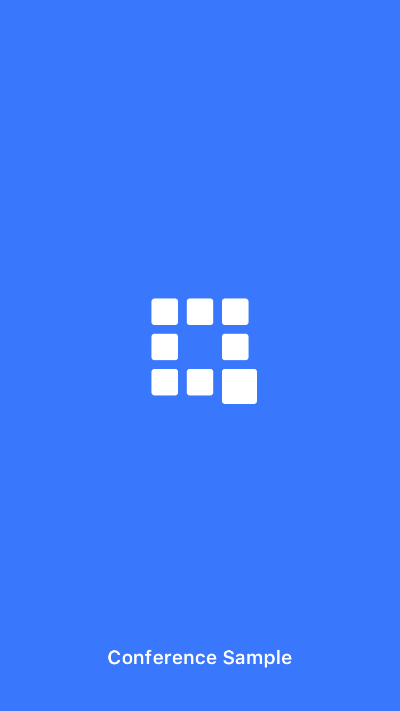
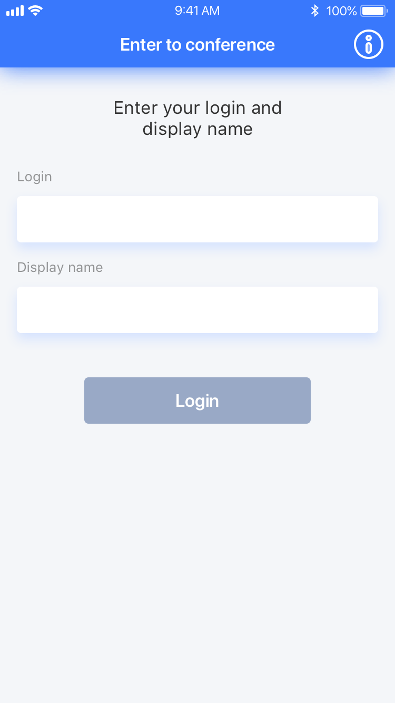
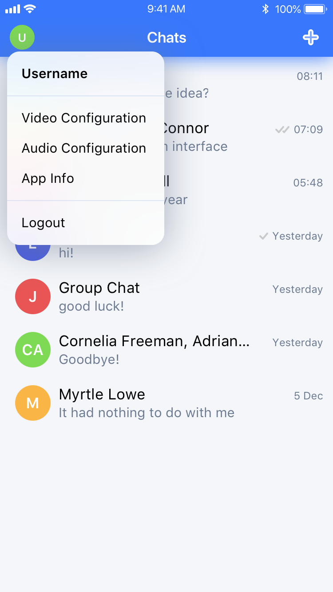
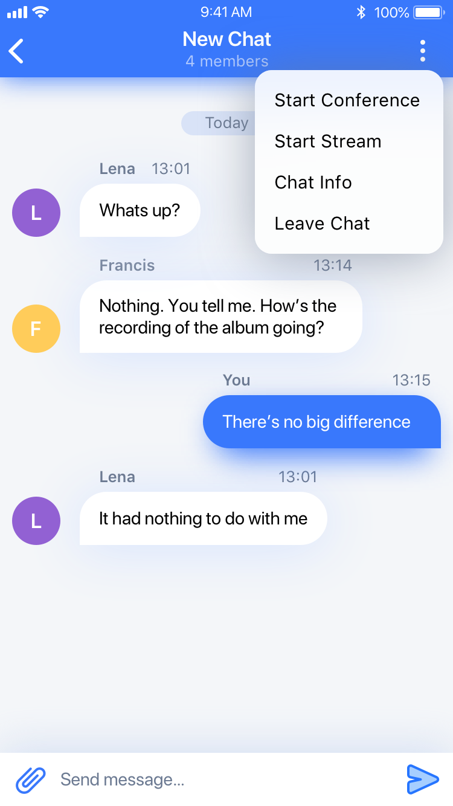

# Get application credentials
QuickBlox application includes everything that brings messaging right into your application - chat, video calling, users, push notifications, etc. To create a QuickBlox application, follow the steps below:  
  1. Register a new account following [this link](https://admin.quickblox.com/signup). Type in your email and password to sign in. You can also sign in with your Google or Github accounts.  
  2. Create the app clicking **New app** button.  
  3. Configure the app. Type in the information about your organization into corresponding fields and click **Add** button.  
  4. Go to **Dashboard => _YOUR_APP_ => Overview** section and copy your **Application ID**, **Authorization Key**, **Authorization Secret**, and **Account Key**.

# To run the Conference Kotlin Sample
  1. Clone the repository using the link below:  
        
    git clone https://github.com/QuickBlox/quickblox-android-sdk.git
        
  2. Go to menu **File => Open Project** or **Open an existing Project** if Android Studio is opened.  
  3. Select a path to the sample.  
  4. Select **Use default gradle wrapper** (recommended) and click **OK**.  
  5. [Get application credentials](#get-application-credentials) and get **Application ID**, **Authorization Key**, **Authorization Secret**, and **Account Key**.  
  6. To request a media **SERVER_URL** for a Demo, please contact us, [enterprise@quickblox.com](mailto:enterprise@quickblox.com).  
  7. Open **App.kt** *//src/main/java/com/quickblox/sample/conference/kotlin/App.kt*
     and paste the credentials into the values of constants.  
  

  
  

  
  8. Run the code sample.

# Application architecture
This application takes a clean architecture approach. The conference Kotlin sample is ready for large projects. We do not use libraries from unknown sources. We have separated the business logic (Domain layer) from the data and presentation layers. All layers interact with each other at the interface level, not implementation. This allows the application to scale by changing only the implementation. The Data and Presentation layers know about Domain layer, but  Domain layer does not know about other layers, business logic is encapsulated.
  

  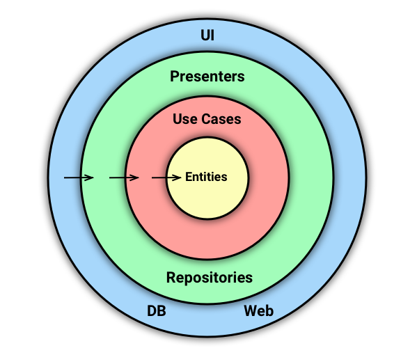
  

  
Layers:
- The Data layer (Repositories) is responsible for getting data from SDK, API, DB, etc.  
- The Domain layer (Use Cases, Entities) is responsible for processing data. It requests data from the Data layer, processes it and gives it to the Presentation layer. All interfaces of interaction with the domain are in the Domain layer. For instance, the repository interfaces are in the Domain layer, and the implementation is in the Data layer. Use cases are managers containing business logic for managing **objects(Entities)**. Entities are objects containing data and business logic.
 

  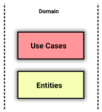
  

  
- The Presentation layer(UI) is responsible for user interaction and displaying data on the screen

How to add new functionality:  
For example, you want to add Billing to your application.
  
  1. You need to add the **BillingRepository** interface to the Domain layer in the repositories package. The repository is the part of the Data layer that is responsible for loading data from, for example, a REST API. Since all obstruction with which the Domain layer interacts must be in it.
  
  

  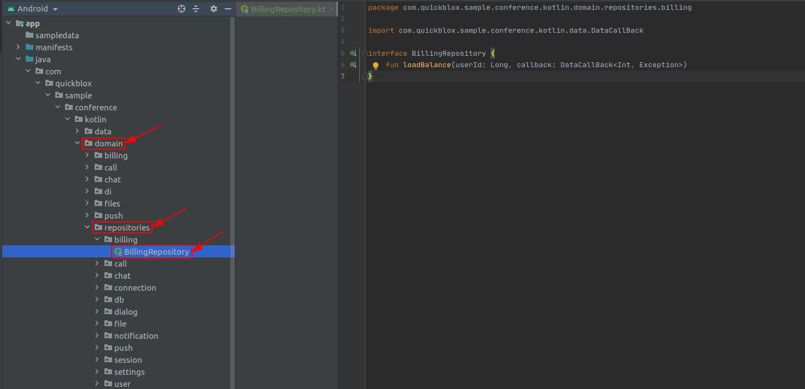
  

  
  2. You need to add an implementation of the **BillingRepository** interface to the Data layer **BillingRepositoryImpl**. It can get data from SDK, API,  etc. The **BillingRepositoryImpl** contains the logic for calling the REST API. For example, the `loadBalance()` method, if we received a successful response with the REST API, we need to transfer the **result(balance)** to the `callback.onSuccess(balance)`, if there is an error, then transfer the error text `callback.onError(error)` and process it.
 
  

  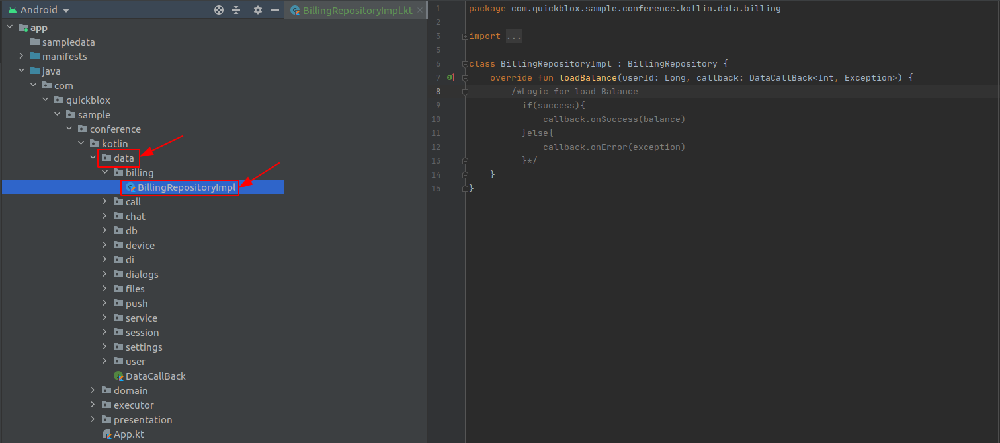
  

   
   3. This sample uses Hilt for Dependency Injection. Hilt is a dependency injection library for Android.
   Link to [Hilt documentation](https://developer.android.com/training/dependency-injection/hilt-android). In order to make an injection of the **BillingRepository** on the Domain layer, you need to create an object **BillingRepositoryModule** in package **di** of Data layer which will provide the **BillingRepository**.
  
   

   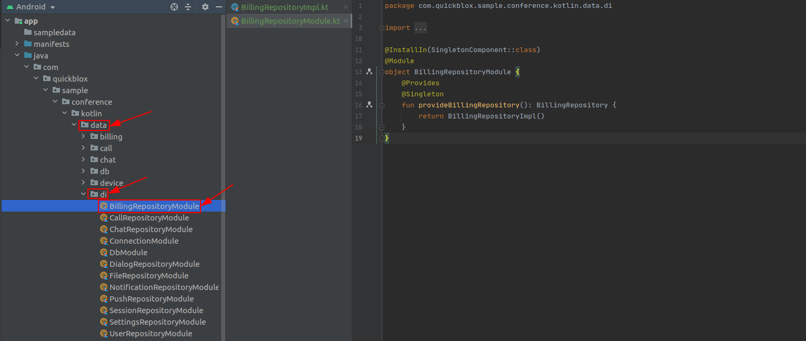
   

  
   4. In the Domain layer, create the **BillingManager** interface and the **BillingManagerImpl** implementation of this interface. Pass the **BillingRepository** interface to the **BillingManagerImpl** constructor, because the manager contains business logic and requests data from the Data layer.
   
   

   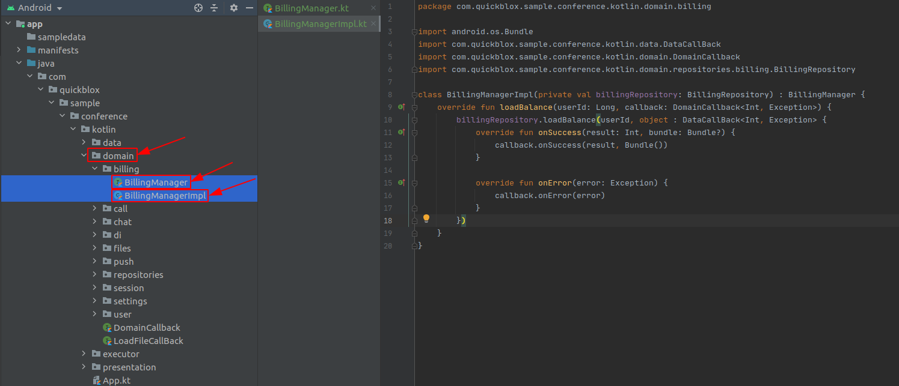
   
 
  
   5. To inject the **BillingManager** into the Presentation layer, you need to create the **BillingManagerModule** object in package **di** of the Domain layer that the **BillingManager** will provide. In the **BillingManagerImpl** constructor, inject the **BillingRepository**.
  
   

   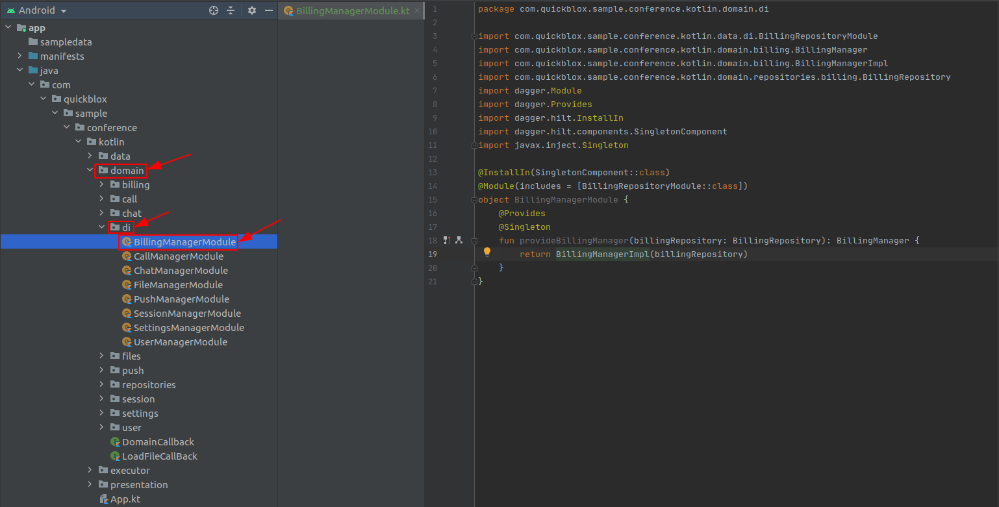
   

   
   6. The ViewModel transfers data to the screen using a **LiveData**. The **LiveData** passes 2 parameters **state** and **data**. Each screen has its own list of states. 
   
   

   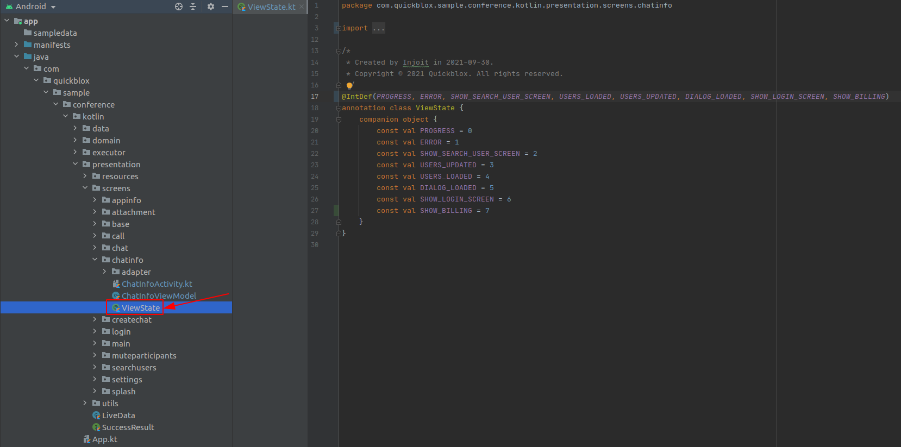
   

   
   When new data is set to **LiveData**, the screen checks what state has arrived and updates the user interface accordingly.
   
   

   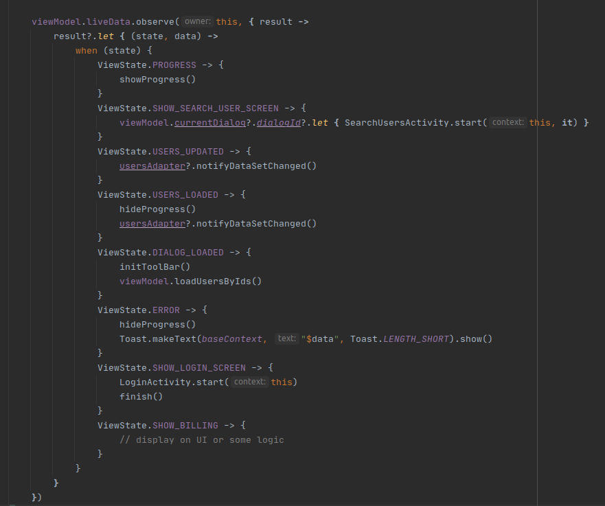
   

   
   7. Inject the **BillingManager** into the ViewModel constructor. In the `loadBalance()` method of the ViewModel we call `billingManager.loadBalance()` and pass the `userId` parameter. If the `onSuccess()` method is called in the callback of this method, then we pass the `ViewState.SHOW_BILLING` state and `result` to **LiveData**, if `onError()`, then we pass the `ViewState.ERROR` state and `error.message`.
      
   

   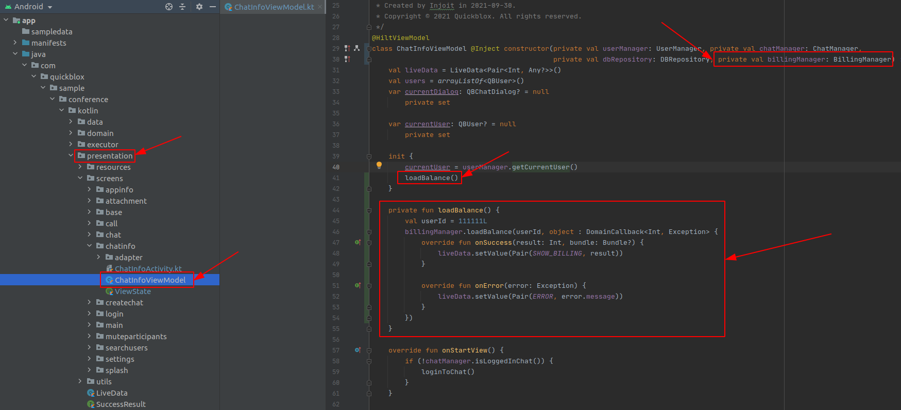
   
