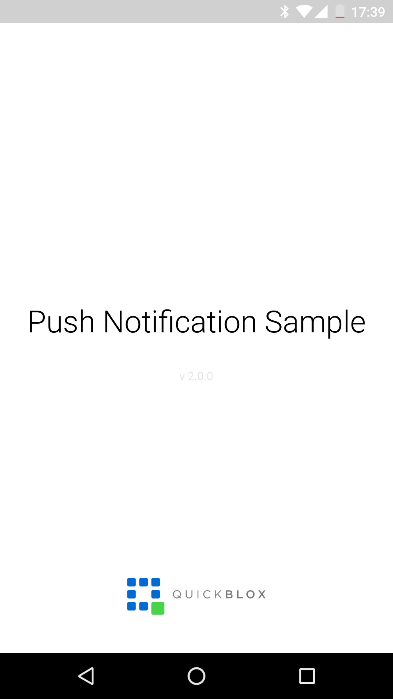
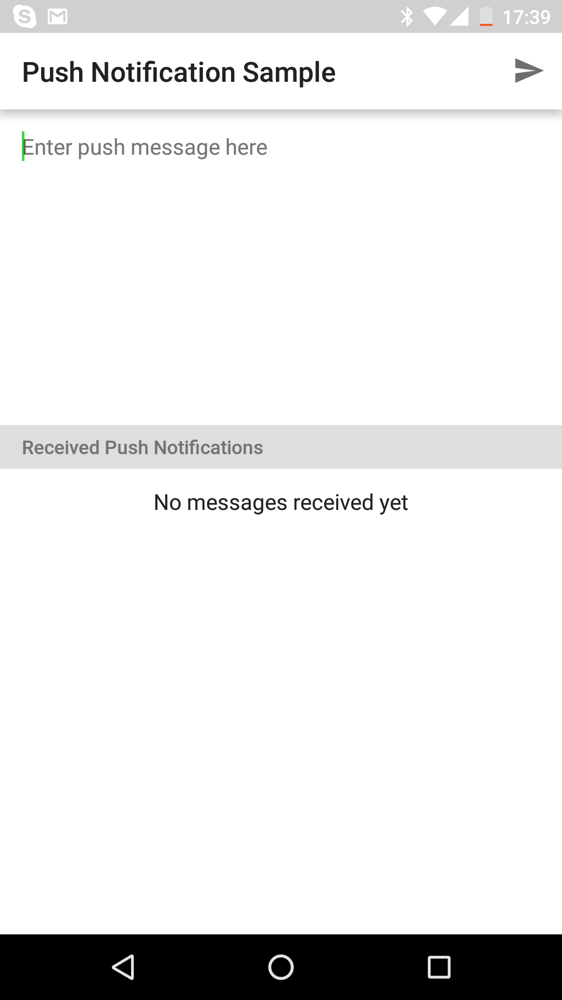
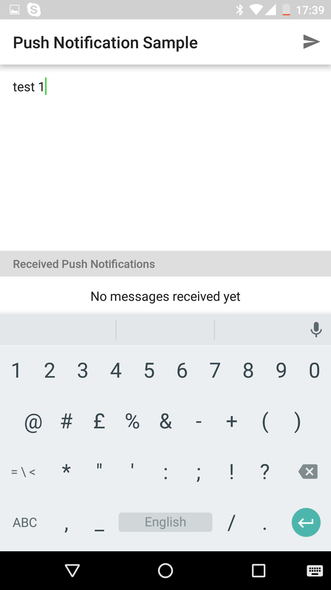
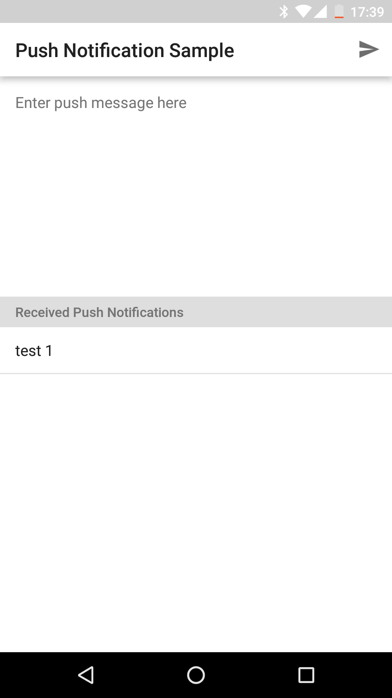

## QuickBlox Android Push Notifications Sample

This is a code sample for [QuickBlox](http://quickblox.com/) platform. It is a great way for developers using QuickBlox platform to learn how to integrate Push Notifications into yours apps.

This sample demonstrates how to work with [Pushes](https://docs.quickblox.com/docs/android-push-notifications) QuickBlox API.
It allows to send and receive Push Notifications. 

It shows how to:
<ul>
<li> Subscribe a User to receive Push Notifications</li>
<li> Send push notification</li>
</ul>

To know how to configure Firebase Account to be able to work with Pushes - please look at [How To Configure Firebase Project](https://docs.quickblox.com/docs/android-push-notifications#configure-firebase-project-and-api-key)

Clone project here and start to work with the code.

&nbsp;&nbsp;&nbsp;
