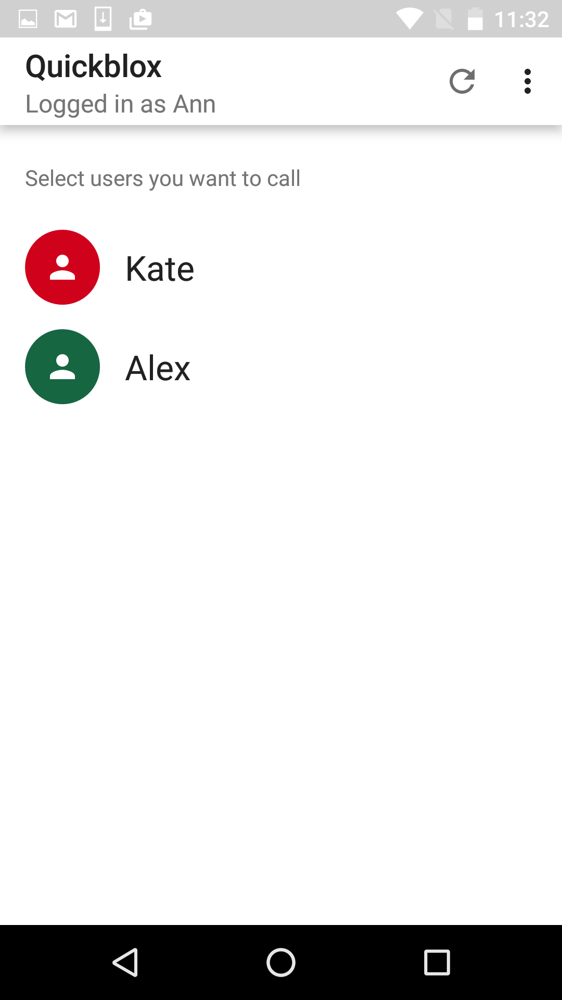

<h2> QuickBlox Android VideoChat Java Sample </h2>

# Overview

This is a code sample for [QuickBlox](http://quickblox.com/) platform.
It is a great way for developers using QuickBlox platform to learn how to integrate audio and video calling features into your application and how to use calling in foreground service.

# Credentials

Welcome to QuickBlox [5 Minute Guide](https://quickblox.com/developers/5_Minute_Guide), where you can get your credentials in just 5 minutes!

# Push Notifications in VideoChat Sample

Push Notifications in this sample used to notify offline user about incoming call.
To send and receive push notifications in sample you should have a Firebase account and Firebase Cloud Messaging project

How QuickBlox Push Notifications work:
(https://quickblox.com/developers/SimpleSample-messages_users-android#How_QuickBlox_Push_Notifications_work)

If you already have GCM (Google Cloud Messaging) account you need to migrate from GCM to FCM:
(https://quickblox.com/developers/How_to_migrate_from_GCM_to_FCM)

If you have no FCM (Firebase Cloud Messaging) account please make the first part (from 1 to 14 points) of this manual:
(https://quickblox.com/developers/How_to_migrate_from_GCM_to_FCM#Creation_of_a_new_project_in_the_FCM_admin_console_and_its_synchronization_with_your_app)

How Push-Notifications API works:
(https://quickblox.com/developers/Messages#Push_Notifications_API)

# To launch the sample

1. Register a free QuickBlox account and add your App there.
2. Update credentials in your application code.[Chat](https://quickblox.com/developers/5_Minute_Guide#Update_authentication_credentials_2)

This Sample demonstrates how to work with [Android VideoChat](https://quickblox.com/developers/Sample-webrtc-android) QuickBlox module.
*this is original sample description & setup guide.

The sample allows to:

1. Authenticate with Quickblox.
2. Receive and display users list.
3. Make audio calls
4. Make video calls
5. Make one-to-one calls
6. Make group calls with more than 2 opponents

# Screenshots

&nbsp;&nbsp;&nbsp;&nbsp; 
&nbsp;&nbsp;&nbsp;&nbsp; 
&nbsp;&nbsp;&nbsp;&nbsp; 
&nbsp;&nbsp;&nbsp;&nbsp; 
&nbsp;&nbsp;&nbsp;&nbsp; 
