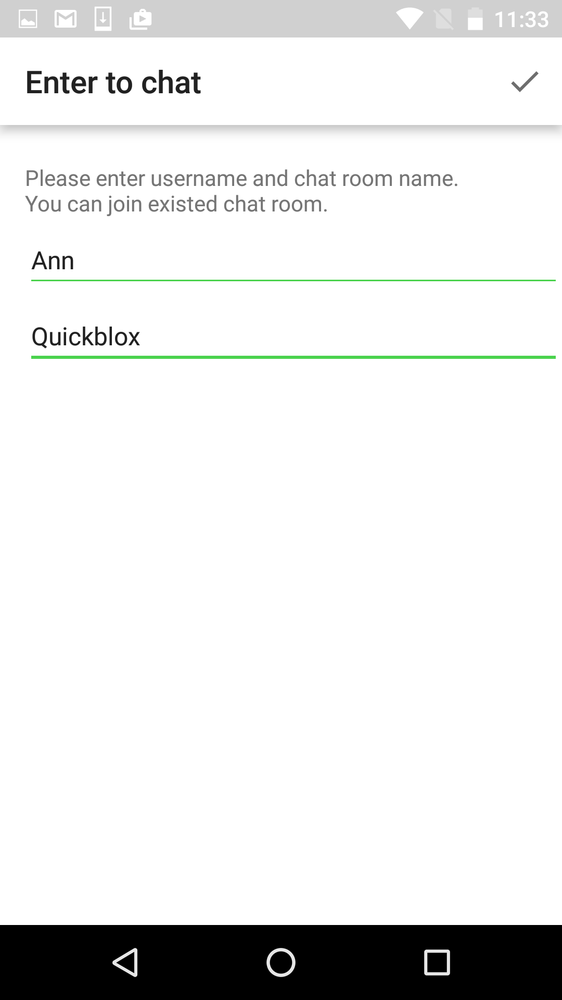
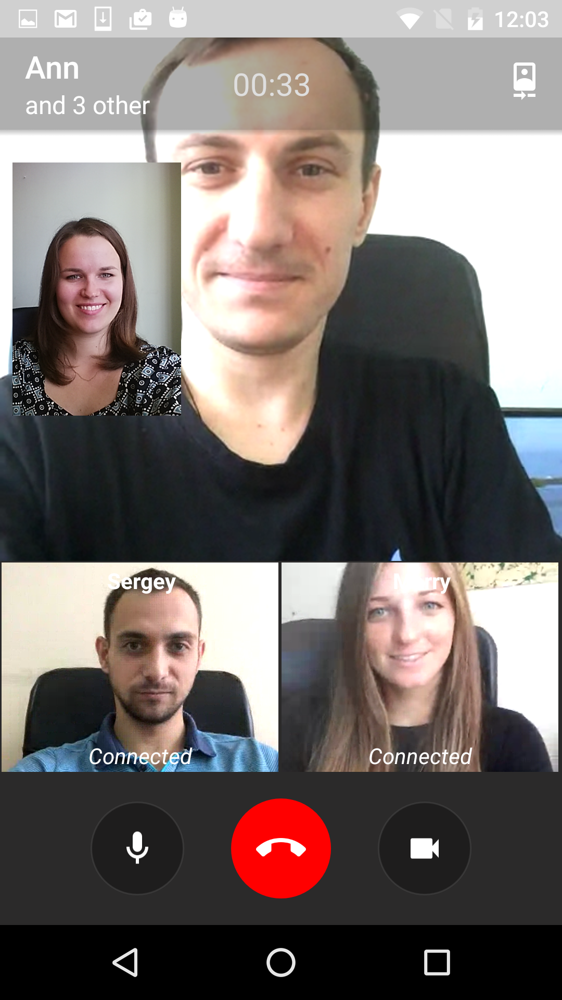
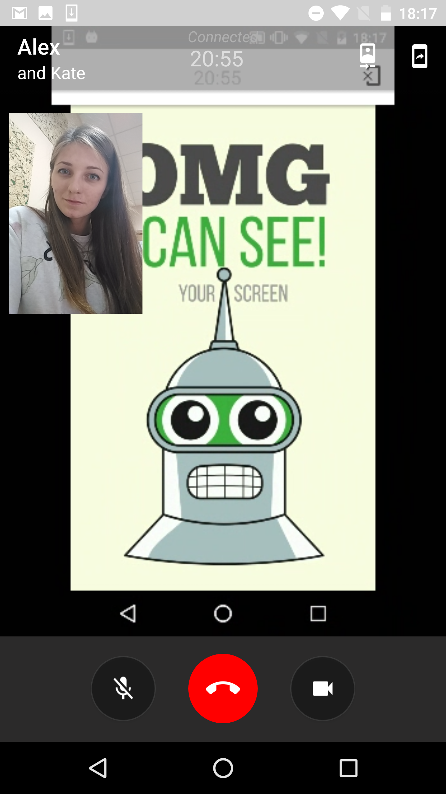

<h2> QuickBlox Android VideoChat Java Sample </h2>

# Overview

This is a code sample for [QuickBlox](http://quickblox.com/) platform.
It is a great way for developers using QuickBlox platform to learn how to integrate audio and video calling features into your application and how to use calling in foreground service.

# Features 
* Login/logout
* Make and receive a 1-to-1 and group audio call
* Make and receive a 1-to-1 and group video call
* Search for users to make a call with
* Mute/unmute the microphone
* Display a list of call participants and their statuses
* Share a screen
* Switch camera
* Receive call stats report
* Change setting (media settings, answer time interval, etc.)
* Switch speaker
# Get application credentials

QuickBlox application includes everything that brings messaging right into your application - chat, video calling, users, push notifications, etc. To create a     QuickBlox application, follow the steps below:

  1. Register a new account following [this link](https://admin.quickblox.com/signup). Type in your email and password to sign in. You can also sign in with your Google or Github accounts.  
  2. Create the app clicking **New app** button.  
  3. Configure the app. Type in the information about your organization into corresponding fields and click **Add** button.  
  4. Go to **Dashboard => _YOUR_APP_ => Overview** section and copy your **Application ID**, **Authorization Key**, **Authorization Secret**, and **Account Key**.  

# Push Notifications in VideoChat Sample

Push Notifications in this sample used to notify offline user about incoming call.
To send and receive push notifications in sample you should have a Firebase account and Firebase Cloud Messaging project

How QuickBlox Push Notifications work:
(https://quickblox.com/developers/SimpleSample-messages_users-android#How_QuickBlox_Push_Notifications_work)

If you already have GCM (Google Cloud Messaging) account you need to migrate from GCM to FCM:
(https://quickblox.com/developers/How_to_migrate_from_GCM_to_FCM)

If you have no FCM (Firebase Cloud Messaging) account please make the first part (from 1 to 14 points) of this manual:
(https://quickblox.com/developers/How_to_migrate_from_GCM_to_FCM#Creation_of_a_new_project_in_the_FCM_admin_console_and_its_synchronization_with_your_app)

How Push-Notifications API works:
(https://quickblox.com/developers/Messages#Push_Notifications_API)

# To run the Video Sample

  1. Clone the repository using the link below:  

    git clone https://github.com/QuickBlox/quickblox-android-sdk.git

  2. Go to menu **File => Open Project**. (Or "Open an existing Project" if Android Studio is just opened)  
  3. Select a path to the sample.  
  4. Select **Use default gradle wrapper** (recommended) and click **OK**.  
  5. [Get application credentials](#get-application-credentials) and get **Application ID**, **Authorization Key**, **Authorization Secret**, and **Account Key**.  
  6. Open **App.kt** (Kotlin sample) / **App.java** (Java sample)
      *//src/main/java/com/quickblox/sample/videochat/java/App.java*
      and paste the credentials into the values of constants.  

    private static final String APPLICATION_ID = "";
    private static final String AUTH_KEY = "";
    private static final String AUTH_SECRET = "";
    private static final String ACCOUNT_KEY = "";

  7. Run the code sample.

This Sample demonstrates how to work with [Android VideoChat](https://quickblox.com/developers/Sample-webrtc-android) QuickBlox module.

The sample allows to:

1. Authenticate with Quickblox.  
2. Receive and display users list.  
3. Make audio calls  
4. Make video calls  
5. Make one-to-one calls  
6. Make group calls with more than 2 opponents  

# Screenshots

&nbsp;&nbsp;&nbsp;&nbsp; 
&nbsp;&nbsp;&nbsp;&nbsp; 
&nbsp;&nbsp;&nbsp;&nbsp; 
&nbsp;&nbsp;&nbsp;&nbsp; 
&nbsp;&nbsp;&nbsp;&nbsp; 
